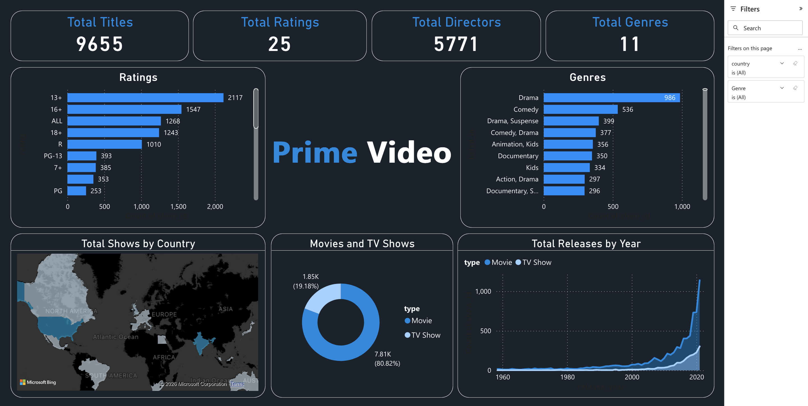

# Amazon Prime User Activity Analysis in Power BI

## Overview

This project is an interactive Power BI dashboard that analyzes the Amazon Prime Video catalog. The dataset contains around 10,000 movies and TV shows available on the platform, including details such as title, genre, rating, release year, director, and country.

The goal of this project is to explore content distribution and identify key trends in Amazon Prime’s library.

---

## Dashboard Preview

---

## Key Metrics

- Total Titles: 9,655
- Total Ratings Categories: 25
- Total Directors: 5,771
- Total Genres: 11

---

## Key Insights

- Most content on Amazon Prime is Movies compared to TV Shows
- Drama is the most common genre on the platform
- The majority of content is rated for 13+ and 16+ audiences
- Content production increased significantly after 2000
- The United States and India are among the most represented countries

---

## Tools Used

- Power BI
- Data cleaning and transformation in Power Query
- Data visualization and dashboard design

---

## Project Structure

data/
dashboard/
screenshots/
docs/

---

---

## Dataset

The dataset used in this project contains Amazon Prime Video listings up to 2021 and includes metadata such as:
- Title
- Genre
- Cast
- Director
- Release year
- Rating
- Duration

---

## Author

Mehdi Zorkani. Built for portfolio purposes in data analysis and visualization using Power BI.
